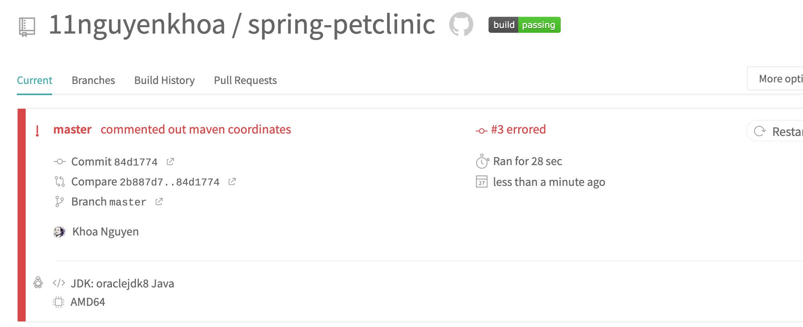

**Khoa Nguyen HW5 #1298555**

#### Your Github account showing that is has been forked from the depaulcdm/springpetclinic repository.

#### Your Travis CI dashboard showing a successful first build.

#### The section of the POM file showing the coordinates after you’ve changed them.

#### Your Travis CI dashboard showing a successful build after your change of the group ID.

#### The section of the POM file showing the coordinates after you’ve commented them out.

#### Your Travis CI dashboard showing the unsuccessful build after the breaking change.

#### Your Github repository with the readme.md file selected showing the build failed status after the Travis CI build fails.

#### The section of the POM file showing the coordinates after you’ve fixed them.

#### Your Travis CI dashboard showing the successful build after the breaking change has been fixed.

#### Your Github repository with the readme.md file selected showing the build success status after the Travis CI build has recovered.
